### Tugas 3 Sistem Operasi
Nama : Delphia Aryana

NIM : 2110131220012

Sistem Operasi Linux Debian 11

 

<h2 align="center"> Komponen Sistem Operasi </h2>

Secara umum, para pakar sepakat bahwa terdapat sekurangnya empat komponen manajemen utama sistem operasi, yaitu :

- Manajemen proses
- Manajemen memori
- Manajemen sistem berkas
- Manajemen masukan/keluaran (I/O)

Selain keempat komponen di atas, Avi Silberschatz, dan kawan-kawan menambahkan beberapa komponen,  seperti : 

- Manajamen penyimpanan sekunder
- Manajemen sistem proteksi
- Manajemen jaringan
- _Command-Interpreter System_

 

Di sini saya akan memberikan 4 contoh komponen sistem operasi :

### 1. Manajemen Proses

Gambar di bawah ini menampilkan program-program yang sedang dieksekusi. Di sini saya membuka lewat System Monitor yang tersedia di Linux Debian 11.

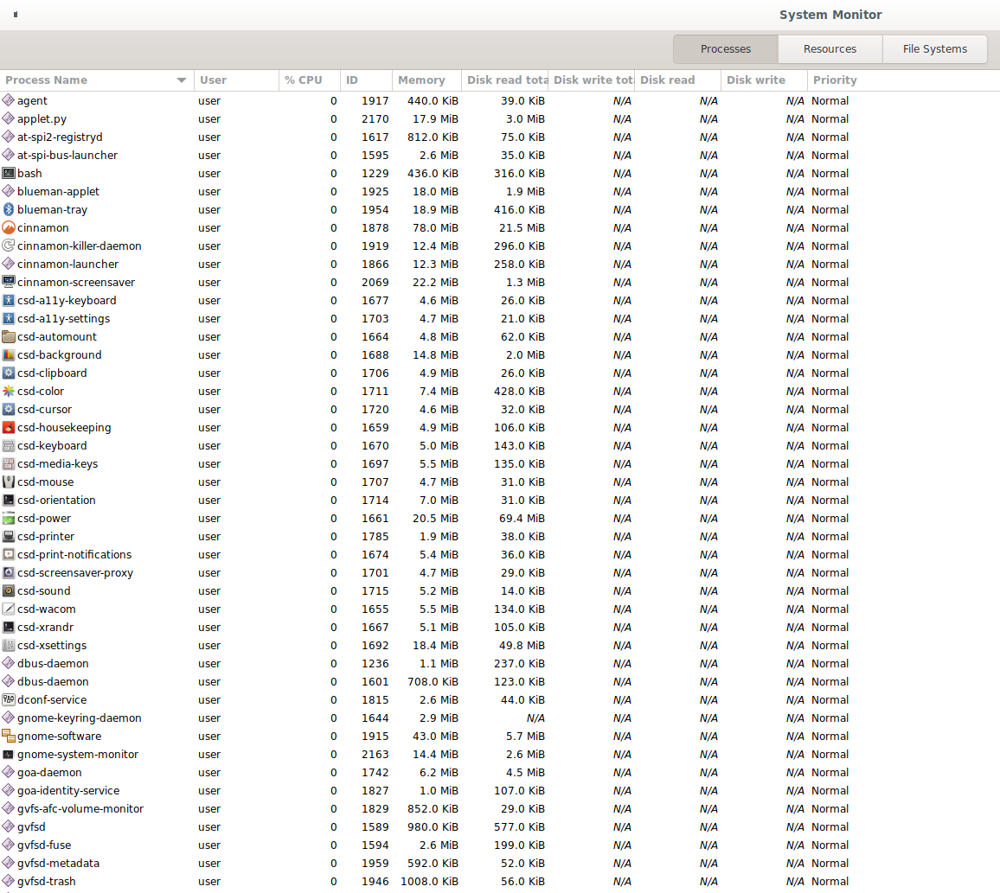

 

### 2. Manajemen Memori

 Pada system monitor juga terdapat manajemen memori yang merupakan tindakan untuk mengelola memori laptop saya.

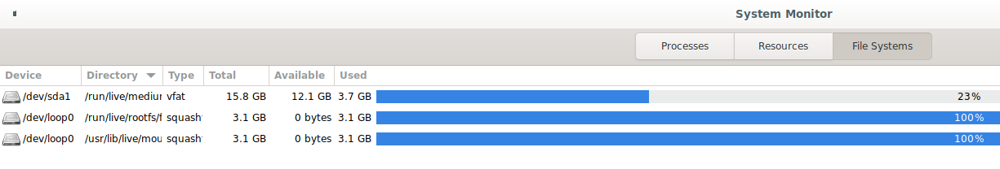

 

### 3. Manajemen Sistem Berkas

 Sistem operasi bertanggung-jawab dalam aktivitas yang berhubungan dengan manajemen berkas, seperti pembuatan berkas, penghapusan berkas, dll. Berikut merupakan contoh membuat folder pada Linux Debian 11.

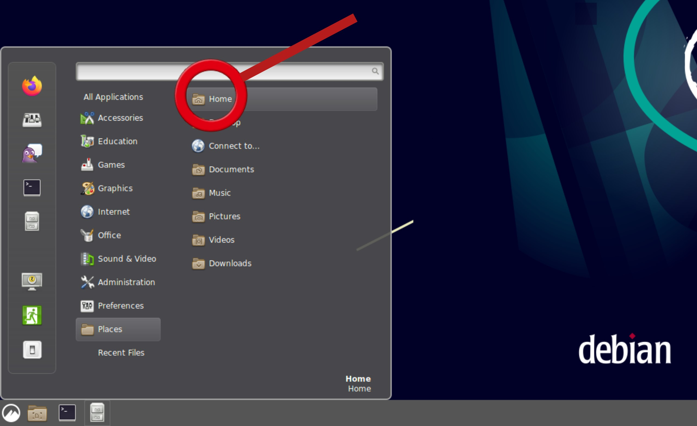

Pilih file atau langsung klik <i>icon home</i>

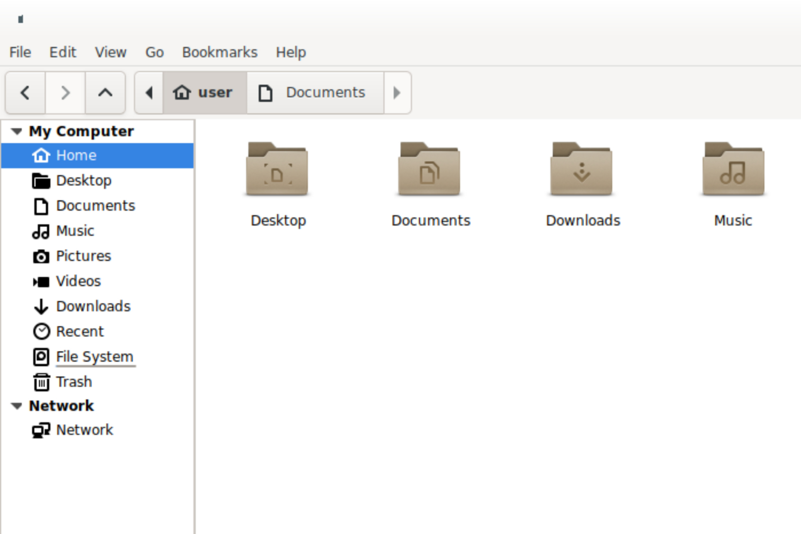

Jika sudah berada pada tampilan home, klik kanan lalu pilih <i>create new folder</i>

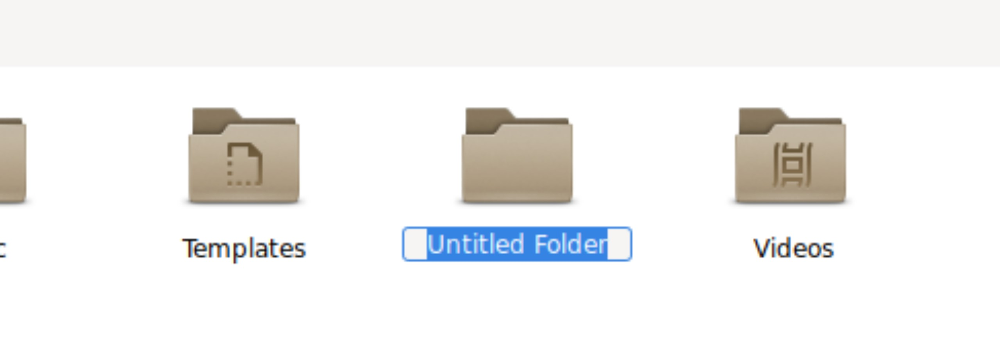

Akan muncul folder baru yang belum memiliki nama <i>(untitled folder)</i>

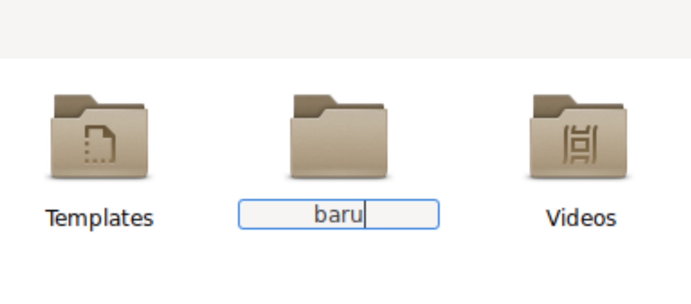

Beri nama folder tersebut

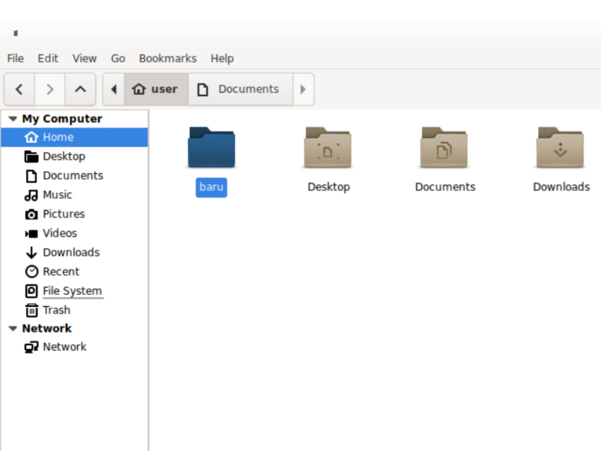

Jika sudah, klik enter. Maka folder baru siap untuk digunakan.

 

### 4. Manajemen Masukan/Keluaran (I/O)

 Pada <i>command line</i>, Ps merupakan inputan yang sudah ada dari sistem. Jika ingin meminta inputan dari keyboard, gunakan perintah cat. Maka output akan langsung tampil.

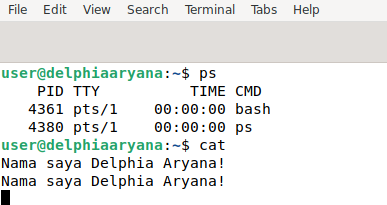

 

<h2 align="center"> Layanan Sistem Operasi </h2>

Layanan sistem operasi dirancang untuk membuat pemrograman menjadi lebih mudah. Sebuah sistem operasi yang baik menurut Tanenbaum harus memiliki layanan sebagai berikut:

1. Pembuatan program
2. Eksekusi program
3. Operasi I/O (pengaksesan I/O device)
4. Sistem manipulasi berkas
5. Komunikasi
6. Deteksi error
7. Deteksi dan pemberian tanggapan pada kesalahan
8. Efesiensi penggunaan sistem
9. _Accounting_

 

Di sini saya akan memberikan 3 contoh layanan sistem operasi :

### 1. Membuat Catatan

 Di Linux Debian 11 terdapat alat pemrosesan kata untuk membuat catatan yang bernama <b>Gnote</b>. Berikut merupakan contoh penggunaannya.

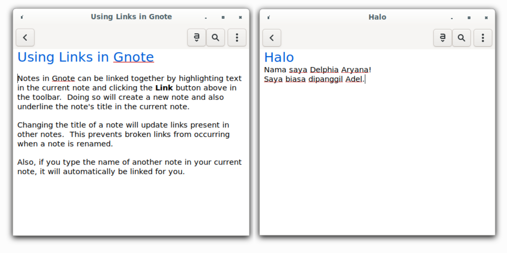

 

### 2. Deteksi Error

Contoh di bawah merupakan laporan saat sistem operasi tidak dapat memasang lokasi. Sistem operasi gagal menerima daftar berbagi dari server karena tidak ada file atau direktori yang diminta. Sehingga pengguna dapat mengambil langkah selanjutnya. 

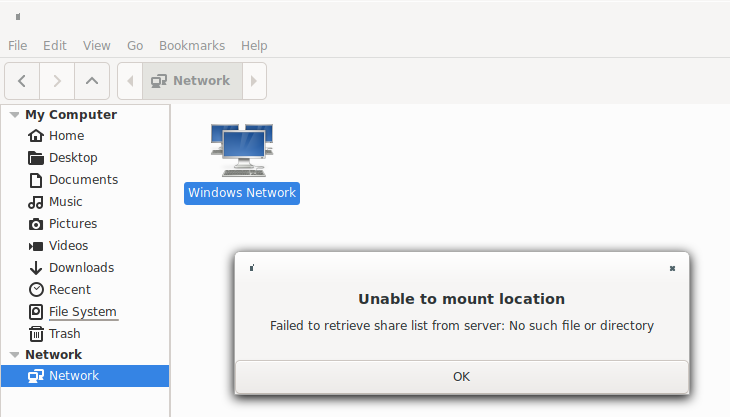

 
 

### 3. Proteksi

Layanan proteksi memastikan bahwa segala akses ke sumber daya terkontrol dan aman. Hal ini bisa dilakukan dengan meminta password bila ingin menggunakan sumber daya. Di bawah ini merupakan contoh proteksi pada <i>command line</i>.

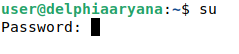

 

<h2 align="center"> System Call </h2>

 <i>System call</i> dapat diartikan sebagai penyedia antar muka dari pelayanan-pelayanan yang tersedia dengan sistem operasi. Biasanya tersedia sebagai instruksi bahasa <i>assembly</i>. Beberapa sistem mengizinkan <i>system calls</i> dibuat langsung dari program bahasa tingkat tinggi. Beberapa bahasa pemrograman (contoh: C, C++) telah didefenisikan untuk menggantikan bahasa <i>assembly</i> untuk sistem pemrograman. Berikut merupakan jenis-jenis <i>system call</i> :

- Manajemen proses _(proses control)_
- Manajemen berkas _(file management)_
- Manajemen piranti _(device management)_
- Informasi/pemeliharaan _(information maintance)_
- Komunikasi _(communication)_

 

Di sini saya akan memberikan 3 contoh <i>system call</i> :

### 1. Manajemen Berkas

 Manajemen berkas merupakan layanan sistem operasi yang dimana program harus mengatur berkas seperti membuat dan menghapus berkas. Berikut contohnya pada <i>command line</i>.

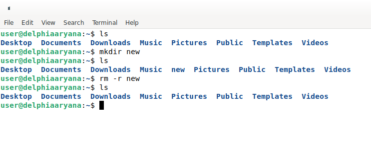

 

### 2. Manajemen Proses

- Menampilkan Proses Linux

Perintah yang paling banyak digunakan untuk melihat proses adalah <b>top</b> dan <b>ps</b>. Perbedaannya dengan top adalah top lebih sering digunakan secara interaktif dan ps lebih sering digunakan dalam script, digabungkan dengan perintah bash lainnya atau yang serupa. Setelah perintah dieksekusi, layout baru akan muncul dan daftar beberapa proses akan secara konstan diperbaharui setiap detik. Layout baru ini sebenarnya bisa dikendalikan melalui keyboard Anda.

Top :

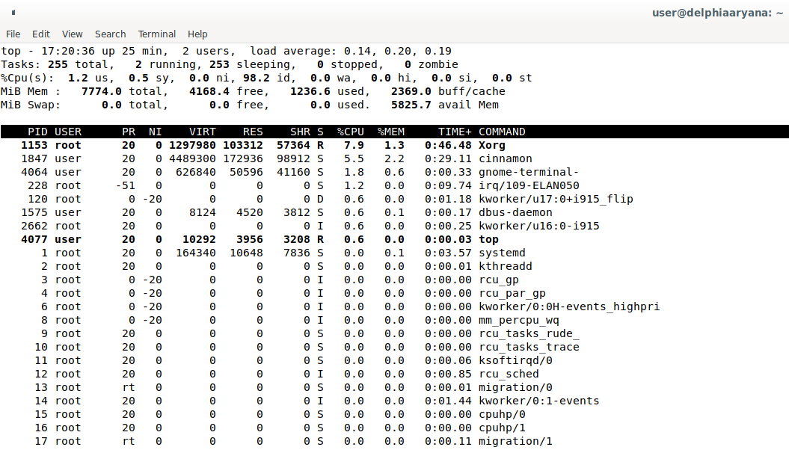

Ps :

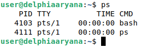

 

- Mematikan Prioritas Proses

Ketika sebuah proses menggunakan sumber daya terlalu tinggi. Biasanya hal ini membuat kinerja perangkat menjadi lambat atau bahkan dapat menyebabkan <b>hang</b> Biasanya untuk mencegah dan mengatasi ini dilakukan penanganan atau mematikan proses yang tidak terlalu dibutuhkan. Salah satu caranya adalah dengan menggunakan perintah <b>kill</b>. Perintah ini digunakan untuk mengirimkan sinyal ke proses untuk menghentikan aktivitasnya.

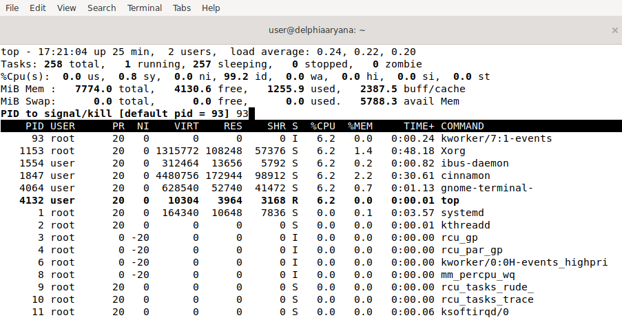

Jika perintah di atas dijalankan, maka aplikasi yang dipilih akan berhenti.

 

### 3. Informasi/Pemeliharaan

Pada command line, informasi mengenai memori tersedia melalui free perintah. Pada Debian GNU/Linux, Ubuntu dan Linux Mint program ini merupakan bagian dari paket procps.

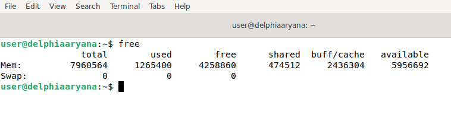

