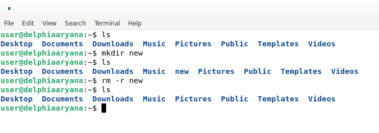

### Tugas 3 Sistem Operasi
Nama : Delphia Aryana
NIM : 2110131220012

 

<h2 align="center"> Komponen Sistem Operasi </h2>

Secara umum, para pakar sepakat bahwa terdapat sekurangnya empat komponen manajemen utama sistem operasi, yaitu :

- Manajemen proses
- Manajemen memori
- Manajemen sistem berkas
- Manajemen masukan/keluaran (I/O)

Selain keempat komponen di atas, Avi Silberschatz, dan kawan-kawan menambahkan beberapa komponen,  seperti : 

- Manajamen penyimpanan sekunder
- Manajemen sistem proteksi
- Manajemen jaringan
- _Command-Interpreter System_

 

Di sini saya akan memberikan 3 contoh komponen sistem operasi :

## Manajemen Proses

1. Menampilkan Proses Linux

Perintah yang paling banyak digunakan untuk melihat proses adalah <b>top</b> dan <b>ps</b>. Perbedaannya dengan top adalah top lebih sering digunakan secara interaktif dan ps lebih sering digunakan dalam script, digabungkan dengan perintah bash lainnya atau yang serupa. Perintah top mungkin adalah salah satu yang paling dasar, sering digunakan untuk menampilkan proses teratas yang biasanya mengkonsumsi resource sistem yang paling besar. Top adalah aplikasi yang berdiri sendiri, setelah perintah dieksekusi, layout baru akan muncul dan daftar beberapa proses akan secara konstan diperbaharui setiap detik. Layout baru ini sebenarnya bisa dikendalikan melalui keyboard Anda.

Top :
 

 

Ps :

 

2. Mematikan Prioritas Proses

Ketika sebuah proses menggunakan sumber daya terlalu tinggi. Biasanya hal ini membuat kinerja perangkat menjadi lambat atau bahkan dapat menyebabkan <b>‘hang’</b> Biasanya untuk mencegah dan mengatasi ini dilakukan penanganan atau mematikan proses yang tidak terlalu dibutuhkan. Salah satu caranya adalah dengan menggunakan perintah <b>“kill”</b>. Perintah ini digunakan untuk mengirimkan sinyal ke proses untuk menghentikan aktivitasnya.

 

## Manajemen Memori

Pada command line, informasi mengenai memori tersedia melalui <b>free perintah</b>. Pada Debian GNU/Linux, Ubuntu dan Linux Mint program ini merupakan bagian dari paket procps.

 

## Manajemen Sistem Berkas

 Berkas adalah kumpulan informasi yang berhubungan, sesuai dengan tujuan pembuat berkas tersebut. Umumnya berkas merepresentasikan program dan data. Berkas dapatmempunyai struktur yang bersifat hirarkis (direktori, volume, dll.). Sistem operasi bertanggung-jawab dalam aktivitas yang berhubungan dengan manajemen berkas, seperti pembuatan berkas, penghapusan berkas, dll.

 

## Manajemen Masukan/Keluaran (I/O)

 Sistem ini sering disebut dengan device manager. Menyediakan device driver yang umum sehingga operasi Masukan/Keluaran dapat seragam (membuka, membaca, menulis, menutup). Pada command line, Ps merupakan inputan yang sudah ada dari sistem. Jika ingin meminta inputan dari keyboard, gunakan perintah cat. Maka output akan langsung tampil.

 

<h2 align="center"> Layanan Sistem Operasi </h2>

Layanan sistem operasi dirancang untuk membuat pemrograman menjadi lebih mudah. Sebuah sistem operasi yang baik menurut Tanenbaum harus memiliki layanan sebagai berikut:

1. Pembuatan program
2. Eksekusi program
3. Operasi I/O (pengaksesan I/O device)
4. Sistem manipulasi berkas
5. Komunikasi
6. Deteksi error
7. Deteksi dan pemberian tanggapan pada kesalahan
8. Efesiensi penggunaan sistem
9. _Accounting_

 

Di sini saya akan memberikan 3 contoh komponen sistem operasi :

## Sistem Menipulasi Berkas

 Sistem manipulasi berkas merupakan layanan sistem operasi yang dimana program harus membaca dan menulis berkas, dan kadang kala juga harus membuat dan menghapus berkas. Berikut contohnya pada command line.

 

## Deteksi Error

Untuk setiap jenis error sistem operasi harus bisa mengambil langkah yang tepat untuk mempertahankan jalannya proses komputasi. Misalnya dengan menghentikan jalannya program, mencoba kembali melakukan operasi yang dijalankan, atau melaporkan kesalahan yang terjadi agar pengguna dapat mengambil langkah selanjutnya. 

 

## Proteksi

Layanan proteksi memastikan bahwa segala akses ke sumber daya terkontrol. Dan tentu saja keamanan terhadap gangguan dari luar sistem tersebut. Keamanan bisa saja dilakukan dengan terlebih dahulu mengidentifikasi pengguna. Ini bisa dilakukan dengan meminta password bila ingin menggunakan sumber daya. 

 

<h2 align="center"> System Call </h2>

 <i>System call</i> dapat diartikan sebagai penyedia antar muka dari pelayanan-pelayanan yang tersedia dengan sistem operasi. Biasanya tersedia sebagai instruksi bahasa <i>assembly</i>. Beberapa sistem mengizinkan <i>system calls</i> dibuat langsung dari program bahasa tingkat tinggi. Beberapa bahasa pemrograman (contoh: C, C++) telah didefenisikan untuk menggantikan bahasa <i>assembly</i> untuk sistem pemrograman. Berikut merupakan jenis-jenis <i>system call</i> :

- Manajemen proses _(proses control)_
- Manajemen berkas _(file management)_
- Manajemen piranti _(device management)_
- Informasi/pemeliharaan _(information maintance)_
- Komunikasi _(communication)_

### CONTOH :