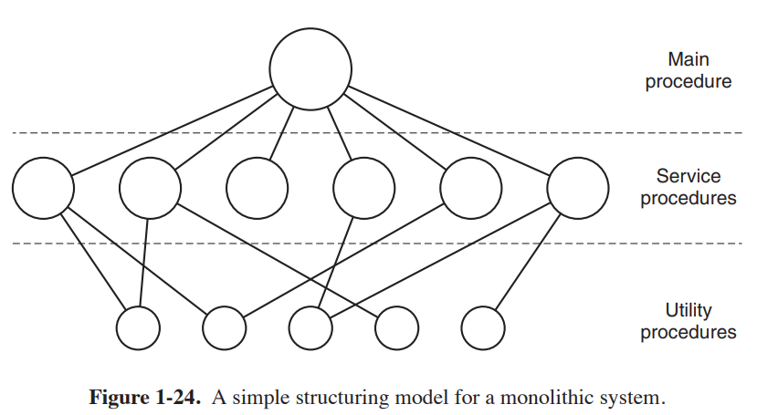
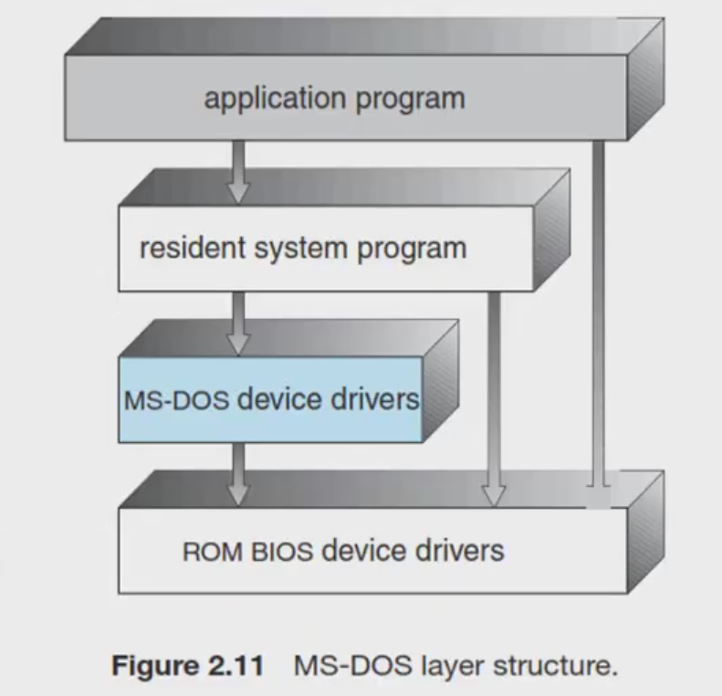
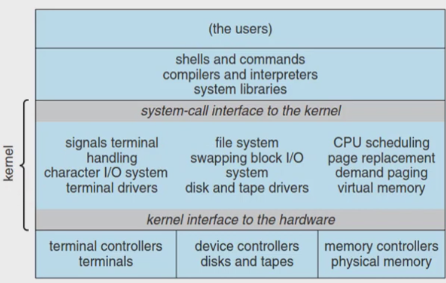
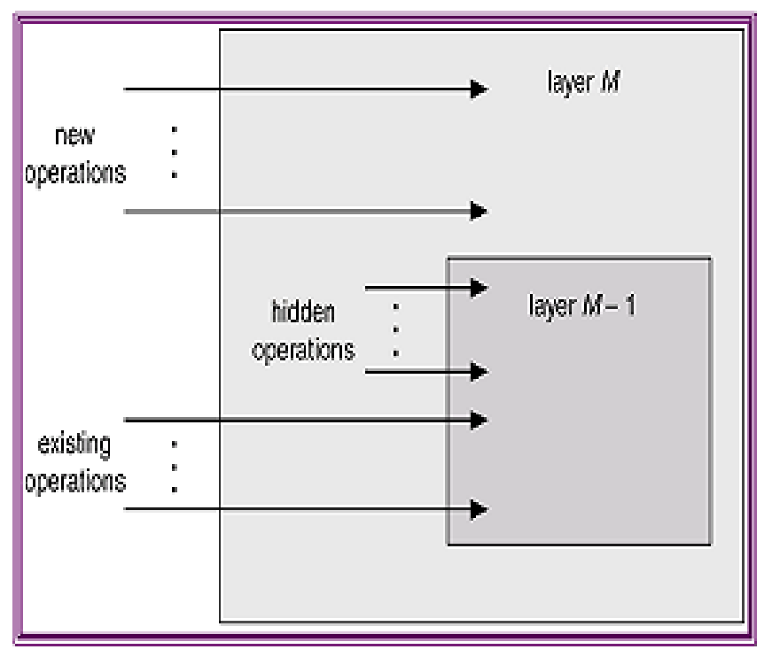
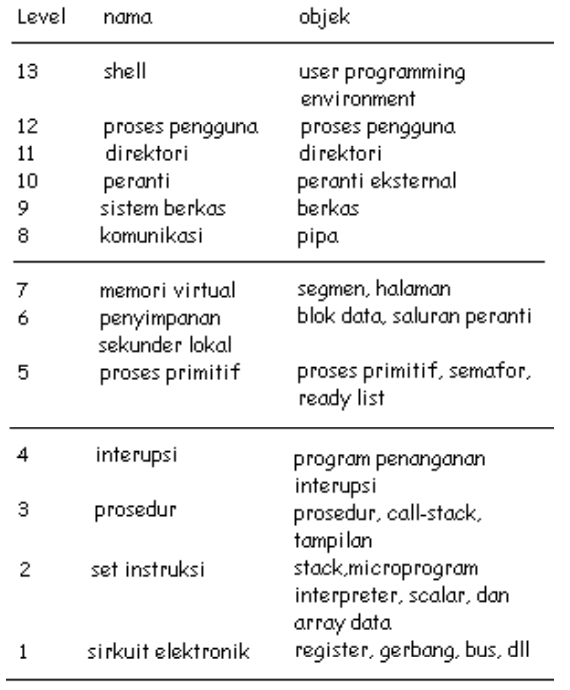
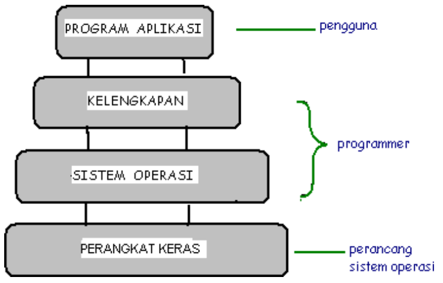
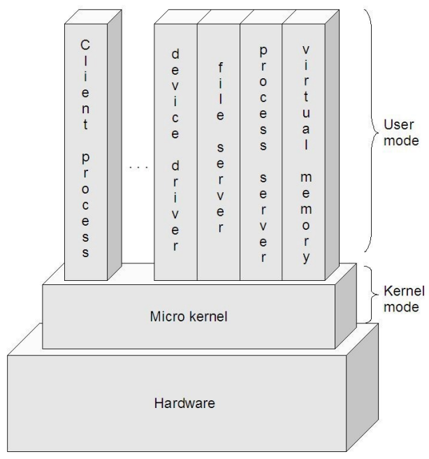

### Tugas 4 Sistem Operasi
Nama : Delphia Aryana

NIM : 2110131220012

<h1 align="center">STRUKTUR SISTEM OPERASI</h1>

Sistem operasi modern merupakan suatu sistem yang besar dan kompleks. Proses mendesain sistem operasi bukanlah pekerjaan yang mudah. Oleh karena itu dalam desain sistem operasi digunakan suatu struktur agar sistem tersebut dapat dipelajari dengan mudah, digunakan, dan dapat dikembangkan lebih lanjut.

Terdapat 3 pendekatan/model struktur sistem operasi :

1. Struktur sederhana
2. Pendekatan berlapis
3. Mikrokernel

 

## 1) Struktur Sederhana (Sistem Monolitik)

Pada awalnya, sistem operasi merupakan sistem yang kecil, sederhana, dan terbatas. Seiring berjalannya waktu, sistem operasi semakin berkembang dengan ruang lingkup originalnya. Dalam perkembangan sistem struktur sederhana, terdapat sistem yang terstruktur dengan baik dan ada juga yang kurang baik.

Sistem monolitik mungkin saja memiliki beberapa struktur. Layanan (panggilan sistem) yang disediakan oleh sistem operasi menempatkan parameter di tempat yang ditentukan dengan baik (misalnya, di tumpukan) dan kemudian mengeksekusi petunjuk/instruksi. Instruksi ini mengalihkan mesin dari mode pengguna ke mode kernel dan mentransfer kontrol ke sistem operasi. Sistem operasi kemudian mengambil parameter dan menentukan panggilan sistem mana yang akan dilaksanakan. Setelah itu, indeks ke dalam tabel yang berisi di slot k pointer ke prosedur yang melakukan panggilan sistem.

Organisasi ini menyarankan struktur dasar untuk sistem operasi:
1. Program utama yang memanggil prosedur layanan yang diminta.
2. Seperangkat prosedur layanan yang melakukan panggilan sistem.
3. Seperangkat prosedur utilitas yang membantu prosedur pelayanan.

Dalam model ini, untuk setiap panggilan sistem ada satu prosedur layanan yang menangani dan mengeksekusi. Prosedur utilitas melakukan hal-hal yang diperlukan oleh beberapa prosedur layanan, seperti mengambil data dari program pengguna. Divisi prosedur ini menjadi tiga lapisan seperti pada gambar di bawah ini.

Kelebihan Struktur Sederhana :
- Layanan dapat dilakukan sangat cepat karena terdapat di satu ruang alamat.

Kekurangan Struktur Sederhana :
- Pengujian dan penghilangan kesalahan sulit karena tidak dapat dipisahkan dan dilokalisasi.
- Sulit dalam menyediakan fasilitas pengaman.
- Pemborosan memori bila setiap komputer harus menjalan kernel, karena semua layanan tersimpan dalam bentuk tunggal sedangkan tidak semua layanan diperlukan.
- Tidak fleksibel.
- Kesalahahan sebagian fungsi menyebabkan matinya seluruh sistem.

 

Contoh sistem operasi yang memiliki struktur sederhana adalah MS-DOS dan UNIX.

### MS-DOS

MS-DOS merupakan contoh sistem struktur sederhana yang kurang baik. MS-DOS menggunakan sistem operasi <i>single tasking</i>, yaitu CPU menyelesaikan satu proses sampai selesai dan tidak dapat disisipi proses lain. Sistem operasi ini dirancang sedemikian rupa agar mampu berjalan pada <i>hardware</i> yang terbatas dan tidak terbagi atas modul-modul.

MS-DOS bersifat <i>single mode</i> yaitu tanpa proteksi perangkat keras. Dalam MS-DOS, perintah internal telah dimasukkan ke dalam <i>command.com</i> (interpreter perintah DOS), sehingga dapat langsung dieksekusi oleh kernel DOS dimana saja. Sedangkan perintah eksternal tidak dimasukkan ke dalam <i>command.com</i>, ini berarti dibutuhkan sebuah berkas yang dapat dieksekusi (berupa program DOS) yang harus terdapat dalam direktoriaktif. Berikut merupakan lapisan struktur MS-DOS.

<i>Lapisan Struktur MS-DOS</i>

 

### UNIX 

UNIX merupakan contoh sistem struktur sederhana yang baik. Sistem operasi ini memiliki kinerja yang lebih baik dari MS-DOS. UNIX adalah sistem operasi yang terdiri dari 2 bagian penting yaitu kernel dan program sistem. Kernel UNIX berisi sistem <i>file</i>, penjadwalan CPU, manajemen memori dan <i>system call</i>. Sedangkan program sistem bertugas memanggil fungsi yang ada pada kernel. Sejak awal, UNIX dirancang untuk mendukung multitasking, yakni dapat mengerjakan lebih dari satu tugas pada waktu yang bersamaan. Misalnya membuka beberapa <i>shell</i> dan mengerjakan tugas-tugas berbeda pada shell-shell tersebut. Selain itu UNIX memperlakukan <i>device</i> dan <i>file</i> dalam derajat yang sama sehingga tidak ada batasan pada jumlah <i>device</i> yang dipasang. Berikut merupakan struktur sistem UNIX.

<i>Struktur Sistem UNIX</i>

 

## 2) Pendekatan Berlapis

Sistem operasi dibagi menjadi sejumlah lapisan yang masing-masing dibangun di atas lapisan yang lebih rendah. Lapisan yang lebih rendah menyediakan layanan untuk lapisan yang lebih tinggi. Lapisan yang paling bawah adalah perangkat keras, dan yang paling tinggi adalah <i>user-interface.</i> 

Sebuah lapisan adalah implementasi dari objek abstrak yang merupakan enkapsulasi dari data dan operasi yang bisa memanipulasi data tersebut. Struktur berlapis dimaksudkan untuk mengurangi kompleksitas rancangan dan implementasi sistem operasi. Tiap lapisan mempunyai fungsional dan antarmuka masukan-keluaran antara dua lapisan bersebelahan. Struktur ini dibagi menjadi beberapa lapisan. Lapisan terbawah (layer 0) adalah <i>hardware</i> dan yang tertinggi (layer N) adalah <i>user-interface</i>. Lapisan N memberi layanan untuk lapisan N+1 sedangkan proses-proses di lapisan N dapat meminta layanan lapisan N-1 untuk membangun layanan lapisan N+1. Lapisan N dapat meminta layanan lapisan N-1 namun lapisan N tidak dapat meminta layanan lapisan N+1. Masing-masing berjalan pada lapisannya sendiri.

 Menurut Tanenbaum dan Woodhull, sistem terlapis terdiri dari enam lapisan, yaitu:

- __Lapisan 0__. Mengatur alokasi prosesor, pertukaran antar proses ketika interupsi terjadi atau waktu habis. Lapisan ini mendukung dasar multi-programming pada CPU.
- __Lapisan 1__. Mengalokasikan ruang untuk proses di memori utama dan pada 512 kilo word drum yang digunakan untuk menahan bagian proses ketika tidak ada ruang di memori utama.
- __Lapisan 2__. Menangani komunikasi antara masing-masing proses dan operator console. Pada lapis ini masing-masing proses secara efektif memiliki opertor console sendiri.
- __Lapisan 3__. Mengatur peranti M/K dan menampung informasi yang mengalir dari dan ke proses tersebut.
- __Lapisan 4__. Tempat program pengguna. Pengguna tidak perlu memikirkan tentang proses, memori, console, atau manajemen M/K.
- __Lapisan 5__. Merupakan operator sistem.

<i>Lapisan pada Sistem Operasi</i>

Menurut Stallings, model tingkatan sistem operasi yang mengaplikasikan prinsip ini terdiri dari beberapa level :

- __Level 1__. Terdiri dari sirkuit elektronik dimana obyek yang ditangani adalah register memory cell, dan gerbang logika. Operasi pada objek ini seperti membersihkan register atau membaca lokasi memori.
- __Level 2__. Pada level ini adalah set instruksi pada prosesor. Operasinya adalah instruksi bahasa-mesin, seperti menambah, mengurangi, load dan store.
- __Level 3__. Tambahan konsep prosedur atau subrutin ditambah operasi call atau return.
- __Level 4__. Mengenalkan interupsi yang menyebabkan prosesor harus menyimpan perintah yang baru dijalankan dan memanggil rutin penanganan interupsi.

Empat level pertama bukan bagian sistem operasi tetapi bagian perangkat keras. Meski pun demikian beberapa elemen sistem operasi mulai tampil pada level-level ini, seperti rutin penanganan interupsi. Pada level 5, kita mulai masuk kebagian sistem operasi dan konsepnya berhubungan dengan multi-programming.

- __Level 5__. Level ini mengenalkan ide proses dalam mengeksekusi program. Kebutuhan-kebutuhan dasar pada sistem operasi untuk mendukung proses ganda termasuk kemampuan men-_suspend_ dan me-_resume_ proses. Hal ini membutuhkan register perangkat keras untuk menyimpan agar eksekusi bisa ditukar antara satu proses ke proses lainnya.
- __Level 6__. Mengatasi penyimpanan sekunder dari komputer. Level ini untuk menjadwalkan operasi dan menanggapi permintaan proses dalam melengkapi suatu proses. 
- __Level 7__. Membuat alamat logik untuk proses. Level ini mengatur alamat virtual ke dalam blok yang bisa dipindahkan antara memori utama dan memori tambahan. Cara-cara yang sering dipakai adalah menggunakan ukuran halaman yang tetap, menggunakan segmen sepanjang variabelnya, dan menggunakan cara keduanya. Ketika blok yang dibutuhkan tidak ada dimemori utama, alamat logis pada level ini meminta transfer dari level 6.

Sampai point ini, sistem operasi mengatasi sumber daya dari prosesor tunggal. Mulai level 8, sistem operasi mengatasi obyek eksternal seperti peranti bagian luar, jaringan, dan sisipan komputer kepada jaringan.

- __Level 8__. Mengatasi komunikasi informasi dan pesan-pesan antar proses. Dimana pada level 5 disediakan mekanisme penanda yang kuno yang memungkinkan untuk sinkronisasi proses, pada level ini mengatasi pembagian informasi yang lebih banyak. Salah satu peranti yang paling sesuai adalah pipe (pipa) yang menerima output suatu proses dan memberi input ke proses lain.
- __Level 9__. Mendukung penyimpanan jangka panjang yang disebut dengan berkas. Pada level ini, data dari penyimpanan sekunder ditampilkan pada tingkat abstrak, panjang variabel yang terpisah. Hal ini bertentangan tampilan yang berorientasikan perangkat keras dari penyimpanan sekunder.
- __Level 10__. Menyediakan akses ke peranti eksternal menggunakan antarmuka standar.
- __Level 11__. Bertanggung-jawab mempertahankan hubungan antara internal dan eksternal identifier dari sumber daya dan obyek sistem. Eksternal identifier adalah nama yang bisa dimanfaatkan oleh aplikasi atau pengguna. Internal identifier adalah alamat atau indikasi lain yang bisa digunakan oleh level yang lebih rendah untuk meletakkan dan mengontrol obyek.
- __Level 12__. Menyediakan suatu fasilitator yang penuh tampilan untuk mendukung proses. Hal ini merupakan lanjutan dari yang telah disediakan pada level 5. Pada level 12, semua info yang dibutuhkan untuk manajemen proses dengan berurutan disediakan, termasuk alamat virtual diproses, daftar obyek dan proses yang berinteraksi dengan proses tersebut serta batasan interaksi tersebut, parameter yang harus dipenuhi proses saat pembentukan, dan karakteristik lain yang mungkin digunakan sistem operasi untuk mengontrol proses.
- __Level 13__. Menyediakan antarmuka dari sistem operasi dengan pengguna yang dianggap sebagai shell atau dinding karena memisahkan pengguna dengan sistem operasi dan menampilkan sistem operasi dengan sederhana sebagai kumpulan servis atau pelayanan.

<i>Tabel Level pada Sistem Operasi</i>

Dapat disimpulkan bahwa lapisan sistem operasi secara umum terdiri atas empat bagian, yaitu:

1. __Perangkat keras__. Lebih berhubungan kepada perancang sistem. Lapisan ini mencakup lapisan 0 dan 1 menurut Tanenbaum, dan level 1 sampai dengan level 4 menurut Stallings.
2. __Sistem operasi__. Lebih berhubungan kepada programer. Lapisan ini mencakup lapisan 2 menurut Tanenbaum, dan level 5 sampai dengan level 7 menurut Stallings.
3. __Kelengkapan__. Lebih berhubungan kepada programer. Lapisan ini mencakup lapisan 3 menurut Tanenbaum, dan level 8 sampai dengan level 11 menurut Stallings.
4. __Program aplikasi__. Lebih berhubungan kepada pengguna aplikasi komputer. Lapisan ini mencakup lapisan 4 dan lapisan 5 menurut Tanebaum, dan level 12 dan level 13 menurut Stallings.

<i>Lapisan Sistem Operasi secara Umum</i>

Keunggulan pendekatan berlapis :

- Karena sistem dibagi menjadi beberapa modul, tiap lapisan dapat dirancangdan diuji secara independen.
- Mempermudah debug dan verifikasi sistem.
- Lapisan pertama bisa didebug tanpa mengganggu sistem yang lain karenahanya menggunakan perangkat keras dasar untuk implementasi fungsinya.
- Bila terjadi error saat debugging sejumlah lapisan, error pasti pada lapisan yang baru saja didebug, karena lapisan dibawahnya sudah di debug.

Kelemahan pendekatan berlapis:
 
- Fungsi-fungsi sistem operasi harus diberikan ke setiap lapisan secara hati-hati.

 

Contoh sistem operasi yang memiliki struktur berlapis :

1. __THE (Technische Hogeschool at Eindhoven)__ merupakan sistem operasi pertama yang dibuat dengan sistem lapisan. THE dibuat oleh djikstra dan mahasiswa-mahasiswanya. 
2. __MULTICS__  dimulai pada tahun 1963 dengan tujuan membangun _operating system timesharing_ yang komprehensif. MULTICS merupakan sistem operasi yang memiliki struktur berlapis dimana program eksekusi dapat diizinkan untuk mengakses sumber daya sistem bernama yang diatur secara hirarkis. 

 

## 3) Mikrokernel

Mikrokernel adalah inti OS kecil yang menyediakan dasar untuk modular extensesi. Metode ini menyusun sistem operasi dengan menghapus semua komponen yang tidak esensial dari <i>kernel</i>, dan mengimplementasikannya sebagai program sistem pada level pengguna. Hasilnya <i>kernel</i> yang lebih kecil. Pada umumnya mikrokernel mendukung proses dan menagemen memori yang minimal, sebagai tambahan untuk fasilitas komunikasi. 

Fungsi utama mikrokernel adalah mendukung fasilitas komunikasi antara program klien dan bermacam-macam layanan yang juga berjalan di <i>user space</i>. Komunikasi yang dilakukan secara tidak langsung didukung oleh sistem <i>message passing</i> dengan bertukar pesan melalui mikrokernel. 

Salah satu keuntungan mikrokernel adalah ketika layanan baru akan ditambahkan ke <i>user space</i>, kernel tidak perlu dimodifikasi. Kalau pun harus, perubahan akan lebih sedikit. Hasil sistem operasinya lebih mudah untuk ditempatkan pada suatu desain perangkat keras ke desain lainnya. Mikrokernel juga mendukung keamanan reliabilitas lebih, karena kebanyakan layanan berjalan sebagai pengguna proses. Jika layanan gagal, sistem operasi lainnya tetap terjaga.

<i>Struktur Kernel Mikro</i>

Keunggulan mikrokernel :
- Interface yang seragam.
- Extensibility. Bisa menambahkan fitur-fitur baru tanpa perlu melakukankompilasi ulang.-
- Flexibility. Fitur-fitur yang sudah ada bisa dikurangi, atau dimodifikasi sesuaidengan kebutuhan sehingga menjadi lebih efisien.-
- Portability. Pada mikrokernel, semua atau sebagian besar kode yang spesifikberada di dalamnya.

Kelemahan mikrokernel :
- Kinerja akan berkurang selagi bertambahnya fungsi-fungsi yang digunakan.

 

Contoh struktur sistem operasi mikrokernel :

### Mac OS

Mac OS adalah sistem operasi yang menggunakan kernel BSD sehinggabeberapa kalangan mengatakan bahwa Mac OS X termasuk dalam keluarga UNIX. Kernel Mac OS mengusung metode struktur ini untuk menghilangkan komponen-komponen yang tidak diperlukan dari kernel dan mengimplementasikannya sebagai sistem dan program-program level user.Hal ini akan menghasilkan kernel yang kecil. Fungsi utama dari jenis ini adalah menyediakan fasilitas komunikasi antara program client dan bermacam pelayanan yang berjalan pada ruang user.

 

### Symbian OS

Sysbian OS merupakan sebuah sistem operasi yang populer digunakan pada <i>handphone, handheld device, embedded device,</i> dan PDA <i>Phone.</i> Sistem operasi ini dikembangkan oleh Symbian Ltd yang dirancang untuk digunakan peralatan melakukan usaha <i>(mobile).</i> Symbian OS memiliki arsitektur mikrokernel, yang membedakannya dari sistem operasi seperti Microsoft Windows dan Linux. Dalam Symbian OS, layanan inti yang akan berada di dalam kernel dalam sistem operasi monolitik dipindahkan ke luar. Penggunaan arsitektur <i>client-server</i> yang meluas, dan perlindungan kode sistem dari klien yang mengikutinya, menjamin ketahanan dan ketersediaan tinggi dari layanan ini. Tujuannya adalah sistem yang kuat yang juga responsif dan dapat diperluas.