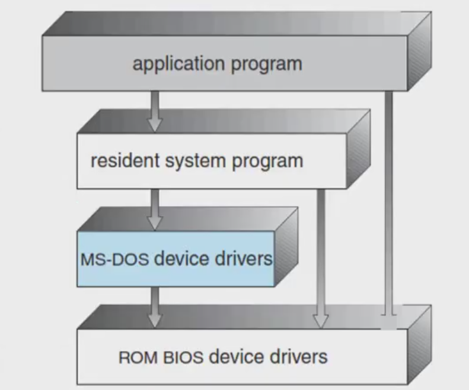

### Tugas 4 Sistem Operasi
Nama : Delphia Aryana

NIM : 2110131220012

<h1 align="center">STRUKTUR SISTEM OPERASI</h1>

Sistem operasi modern merupakan suatu sistem yang besar dan kompleks. Proses mendesain sistem operasi bukanlah pekerjaan yang mudah. Oleh karena itu dalam desain sistem operasi digunakan suatu struktur agar sistem tersebut dapat dipelajari dengan mudah, digunakan, dan dapat dikembangkan lebih lanjut.

Terdapat 3 pendekatan/model struktur sistem operasi :

1. Struktur sederhana
2. Struktur berlapis
3. Mikrokernel

 

## Struktur Sederhana

Pada awalnya, sistem operasi merupakan sistem yang kecil, sederhana, dan terbatas. Seiring berjalannya waktu, sistem operasi semakin berkembang dengan ruang lingkup originalnya. Dalam perkembangan sistem struktur sederhana, terdapat sistem yang terstruktur dengan baik dan ada juga yang kurang baik.

Kelebihan Struktur Sederhana :
- Layanan dapat dilakukan sangat cepat karena terdapat di satu ruang alamat.

Kekurangan Struktur Sederhana :
- Pengujian dan penghilangan kesalahan sulit karena tidak dapat dipisahkan dan dilokalisasi.
- Sulit dalam menyediakan fasilitas pengaman.
- Pemborosan memori bila setiap komputer harus menjalan kernel, karena semua layanan tersimpan dalam bentuk tunggal sedangkan tidak semua layanan diperlukan.
- Tidak fleksibel.
- Kesalahahan sebagian fungsi menyebabkan matinya seluruh sistem.

 

Contoh sistem operasi yang memiliki struktur sederhana adalah MS-DOS dan UNIX.

### 1. MS-DOS

MS-DOS merupakan contoh sistem struktur sederhana yang kurang baik. MS-DOS menggunakan sistem operasi <i>single tasking</i>, yaitu CPU menyelesaikan satu proses sampai selesai dan tidak dapat disisipi proses lain. Sistem operasi ini dirancang sedemikian rupa agar mampu berjalan pada <i>hardware</i> yang terbatas dan tidak terbagi atas modul-modul.

MS-DOS bersifat <i>single mode</i> yaitu tanpa proteksi perangkat keras. Dalam MS-DOS, perintah internal telah dimasukkan ke dalam <i>command.com</i> (interpreter perintah DOS), sehingga dapat langsung dieksekusi oleh kernel DOS dimana saja. Sedangkan perintah eksternal tidak dimasukkan ke dalam <i>command.com</i>, ini berarti dibutuhkan sebuah berkas yang dapat dieksekusi (berupa program DOS) yang harus terdapat dalam direktoriaktif. Berikut merupakan lapisan struktur MS-DOS.

 

### 2. UNIX 

UNIX merupakan contoh sistem struktur sederhana yang baik. Sistem operasi ini memiliki kinerja yang lebih baik dari MS-DOS. UNIX adalah sistem operasi yang terdiri dari 2 bagian penting yaitu kernel dan program sistem. Kernel UNIX berisi sistem <i>file</i>, penjadwalan CPU, manajemen memori dan <i>system call</i>. Sedangkan program sistem bertugas memanggil fungsi yang ada pada kernel. Sejak awal, UNIX dirancang untuk mendukung multitasking, yakni dapat mengerjakan lebih dari satu tugas pada waktu yang bersamaan. Misalnya membuka beberapa <i>shell</i> dan mengerjakan tugas-tugas berbeda pada shell-shell tersebut. Selain itu UNIX memperlakukan <i>device</i> dan <i>file</i> dalam derajat yang sama sehingga tidak ada batasan pada jumlah <i>device</i> yang dipasang. Berikut merupakan struktur sistem UNIX.

